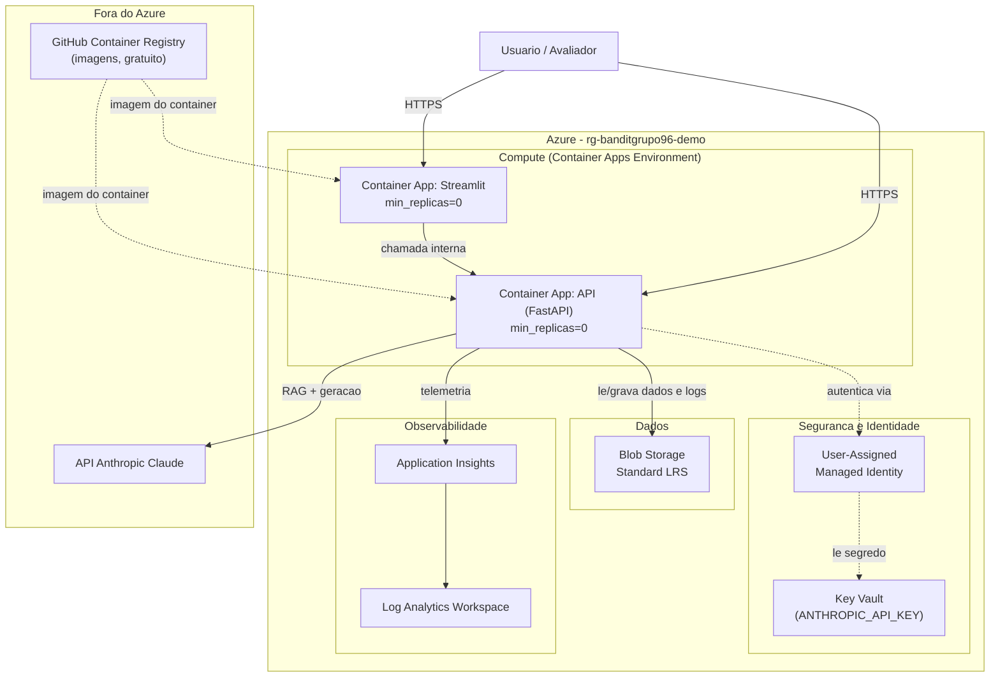

# Arquitetura-alvo Azure

Esta é a arquitetura-alvo para operar a plataforma em produção, usando
exclusivamente serviços Azure, otimizada para o menor custo possível dado o
volume esperado (uma demonstração/avaliação, não uma carga real de produção).
O Terraform em `infra/terraform/` implementa exatamente o que está descrito
aqui (`terraform validate` já confirma que a configuração é consistente;
`terraform apply` real fica pendente de uma assinatura Azure configurada — ver
"Plano de deploy" abaixo).

## Diagrama

## Mapeamento de camadas

| Camada | Serviço Azure | Justificativa |
|---|---|---|
| Compute | Azure Container Apps (Consumption, `min_replicas=0`) | Serverless: escala a zero sem tráfego, paga só pelo uso real — mais barato que App Service ou AKS para uma demo de baixo volume. |
| API | Container App dedicado, ingress público HTTPS | Mesmo contrato já validado localmente (`docs/service-contract.md`, Etapa 5). |
| Interface | Container App dedicado (Streamlit) | Separado da API para poder escalar/reiniciar independentemente. |
| Dados | Azure Blob Storage (Standard LRS) | Dados pequenos (poucos MB), não críticos, regeneráveis a partir do Kaggle + código sintético — LRS é a redundância mais barata. |
| IA/RAG | Chamada direta à API Anthropic (fora do Azure) + índice `InMemoryVectorStore` reconstruído no início de cada container | Evita hospedar um banco vetorial dedicado para um corpus pequeno (ver `src/bandit_platform/assistant/knowledge_base.py` para a justificativa completa). |
| Observabilidade | Application Insights + Log Analytics Workspace | Rastreamento de requisições, exceções e latência; base para alertas de drift/erro na Etapa 7. |
| Segurança/Segredos | Azure Key Vault (RBAC, `Key Vault Secrets User`) | `ANTHROPIC_API_KEY` nunca em variável de ambiente em texto plano — lida do Key Vault em tempo de execução. |
| Identidade | User-Assigned Managed Identity | Elimina a necessidade de qualquer credencial estática entre os Container Apps e o Key Vault. |
| Governança | `azurerm_consumption_budget_resource_group` (Terraform) | Alerta de orçamento mensal real (não só documentado): limite de US$20/mês com notificação em 80% de consumo, acima da estimativa de ~US$5-10/mês (ver "FinOps" abaixo). |
| Imagens de container | GitHub Container Registry (gratuito) | Decisão deliberada de **não** usar Azure Container Registry (~US$5/mês de taxa fixa mesmo sem uso) — GHCR é gratuito para os volumes desta demo. |

## Plano de gestão de segredos e credenciais

1. `ANTHROPIC_API_KEY` é armazenada como um segredo no Key Vault (`az keyvault
   secret set`, feito manualmente uma vez pelo operador — nunca versionado).
2. Cada Container App recebe uma **User-Assigned Managed Identity** dedicada
   (`azurerm_user_assigned_identity.app`), sem nenhuma senha ou chave estática.
3. Essa identidade recebe o papel RBAC `Key Vault Secrets User` — só leitura
   de segredos, nunca escrita, listagem completa ou exclusão.
4. Em tempo de execução, a aplicação usaria o SDK `azure-identity` +
   `azure-keyvault-secrets` (`DefaultAzureCredential`, que detecta a Managed
   Identity automaticamente) para buscar `ANTHROPIC_API_KEY` — **esse código
   ainda não existe no `bandit_platform.assistant.llm`** (que hoje lê a chave
   de `.env` via `python-dotenv`, adequado para desenvolvimento local). Migrar
   para o Key Vault é trabalho futuro citado como limitação explícita aqui,
   não implementado nesta etapa.
5. Nenhum segredo aparece em `infra/terraform/*.tf` nem em variáveis com
   default — a variável `anthropic_api_key_secret_name` guarda só o *nome* do
   segredo no Key Vault, nunca o valor.

## Plano de deploy

1. Operador roda `az login` (ou configura um Service Principal) — pré-requisito
   que este projeto ainda não tem configurado.
2. `cd infra/terraform && terraform init && terraform plan` — revisar o plano.
3. Build e push das imagens Docker (`Dockerfile.api`, `Dockerfile.streamlit`)
   para o GitHub Container Registry via GitHub Actions (extensão futura do
   workflow de CI já existente desde a Etapa 0).
4. `terraform apply` — **só roda com autorização explícita do usuário no
   momento**, nunca automaticamente.
5. Popular o Key Vault com `ANTHROPIC_API_KEY` manualmente (`az keyvault
   secret set`).
6. Validar `GET /health` e `POST /decide` no endpoint público gerado
   (`terraform output api_url`).

## FinOps: estimativa de custo mensal (baixo volume, demonstração)

| Recurso | SKU | Estimativa mensal |
|---|---|---|
| Container Apps (2 apps, scale-to-zero) | Consumption | US$ 0-5 (dentro da cota gratuita mensal para baixo tráfego) |
| Blob Storage | Standard LRS, poucos GB | < US$ 1 |
| Key Vault | Standard, poucas operações | < US$ 1 |
| Log Analytics + App Insights | Pay-as-you-go, < 5GB/mês | US$ 0 (dentro do free tier) |
| GitHub Container Registry | Gratuito | US$ 0 |
| **Total estimado** | | **~US$ 5-10/mês** |

Comparação: usar Azure Container Registry (Basic) somaria ~US$5/mês fixos
mesmo sem nenhuma imagem sendo puxada — por isso a escolha pelo GHCR gratuito.
Um App Service Plan dedicado (em vez de Container Apps consumption) custaria a
partir de ~US$13/mês mesmo ocioso — por isso a escolha por Container Apps com
`min_replicas=0`.

## Cenários de escala e redução

- **Aumento de tráfego**: `max_replicas` dos Container Apps pode subir (hoje
  2 para a API, 1 para o Streamlit) sem mudança de arquitetura — o Container
  Apps Environment já suporta autoscaling baseado em requisições HTTP
  concorrentes.
- **Redução de custo adicional**: reduzir `retention_in_days` do Log Analytics
  (hoje 30, o mínimo padrão) ou mover dados frios do Blob para a camada
  "Cool"/"Archive" se o volume de dados crescer.
- **Cenário sem uso**: com `min_replicas=0` em ambos os Container Apps, o
  custo de compute cai a praticamente zero quando ninguém está usando a
  plataforma — o único custo residual é armazenamento (Blob, Key Vault) e
  observabilidade, ambos já no free tier ou próximos disso.

## Limitações e trabalhos futuros

- O código da aplicação ainda lê `ANTHROPIC_API_KEY` de `.env`
  (`python-dotenv`), não do Key Vault — a migração para
  `DefaultAzureCredential` + `azure-keyvault-secrets` é necessária antes de um
  deploy real (ver "Plano de gestão de segredos" acima).
- O Blob Storage (`azurerm_storage_account.main`) é provisionado pelo
  Terraform, mas os Container Apps (`compute.tf`) ainda não recebem nenhuma
  connection string ou variável de ambiente que aponte para ele — a
  aplicação (`src/bandit_platform/service/active_policy.py` e módulos
  relacionados) hoje lê os dados de arquivos CSV embutidos na imagem Docker
  via `COPY`, não do Blob Storage em tempo de execução. Migrar a leitura de
  dados para o Blob Storage é trabalho futuro, junto com a migração do
  Key Vault citada acima.
- `terraform apply` nunca foi executado de verdade neste projeto — só
  `init`/`validate`/`fmt` — porque o projeto não tem uma assinatura Azure
  configurada até o momento deste documento.
- O build e push automático das imagens Docker para o GHCR ainda não está
  no workflow de CI (`.github/workflows/ci.yml`) — hoje ele só roda lint e
  testes, não builda containers.
- Esta arquitetura não usa nenhum outro provedor de nuvem além do Azure —
  a única dependência externa é a própria API da Anthropic (necessária por
  definição, já que é o provedor de LLM escolhido) e o GitHub Container
  Registry (só para hospedar as imagens, decisão de custo documentada acima).
