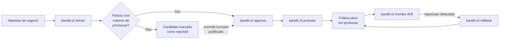

# Ciclo de vida MLOps

Este documento descreve como uma nova política (candidata) sai de
experimento para produção controlada nesta plataforma: quem pode promovê-la,
sob quais critérios, como reverter se algo der errado, e como o desempenho é
monitorado ao longo do tempo. Todo o mecanismo abaixo é código real e
executável (`src/bandit_platform/mlops/`, sete subcomandos de
`bandit-cli`) — não é apenas um plano narrativo.

## Visão geral



## Versionamento de política (Policy Registry)

Cada candidato treinado vira um artefato `.joblib` em `models/registry/`
(nunca versionado no git — ver `.gitignore`) mais um registro em
`models/registry/manifest.json` com: `version_id`, algoritmo, métricas de
avaliação, timestamp, status (`pending_approval` / `approved` / `rejected`)
e, quando aplicável, quem aprovou, quando e por quê. O manifesto também
guarda qual versão está ativa hoje e o histórico de versões anteriores
(usado pelo rollback). Implementado em
`src/bandit_platform/mlops/registry.py` (`class PolicyRegistry`).

## Critérios de promoção

Definidos em `src/bandit_platform/mlops/promotion.py`
(`class PromotionCriteria`), com os seguintes limiares, todos derivados dos
números já estabelecidos em `reports/algorithm-comparison.md` e
`reports/offline-evaluation.md`:

| Critério | Limiar | Justificativa |
|---|---|---|
| Golden-set safety rate | ≥ 100% | As três políticas hoje (baseline, Thompson Sampling, LinUCB) já atingem 100% - não aceitamos regressão nesse critério, é um guardrail de segurança, não de performance. |
| Regret médio absoluto | ≤ 0.03 | Margem acima do pior caso historicamente observado (LinUCB alpha=1.0: 0.029457). |
| Regressão de regret vs. política ativa | ≤ 10% pior | Tolera variação normal de retrain sem permitir uma regressão real de performance. |

Um candidato só é aprovado automaticamente/manualmente sem override quando
passa nos três critérios. Um humano pode aprovar mesmo assim via
`--override` explícito, mas isso fica permanentemente registrado no
manifesto (`approved_via_override: true`) — nunca some silenciosamente. Um
candidato que falhou os critérios já é marcado como `rejected`
automaticamente pelo próprio `retrain`; um humano também pode rejeitar
manualmente a qualquer momento com `bandit-cli reject --version-id <ID>
--reason "<motivo>"`, independente do resultado automático.

## Gate de aprovação humana estruturada

`bandit-cli approve --version-id <ID> --approver "<nome>" --reason "<motivo>"`
é o único caminho para um candidato avançar de `pending_approval` para
`approved`. `bandit-cli promote` recusa promover qualquer versão que não
esteja `approved` (`ValueError` explícito). Isso significa que nenhuma
política chega a produção sem: (1) ter sido avaliada objetivamente contra
os critérios acima, e (2) ter um nome, motivo e timestamp humanos
associados à decisão de aprová-la — mesmo quando essa aprovação é um
override de um candidato que falhou os critérios automáticos.

## Rollback

`bandit-cli rollback` (sem argumentos) reverte para a versão anteriormente
ativa, usando o histórico mantido pelo registro. `bandit-cli rollback --to
<version_id>` permite voltar a qualquer versão específica já registrada.
Não há limite de quantas vezes se pode reverter — cada rollback também
empilha a versão anterior no histórico, então é possível ir e voltar entre
versões livremente.

## Monitoramento de drift

`bandit-cli monitor-drift` cobre dois tipos de sinal, implementados em
`src/bandit_platform/mlops/drift.py`:

1. **Drift de features (entrada)**: compara a distribuição de `job` e
   `poutcome` nas decisões recentes (`logs/decisions.jsonl`, o mesmo log de
   auditoria da Etapa 5) contra a distribuição de referência do dataset de
   treino, usando o Population Stability Index (PSI) — o padrão da
   indústria para esse tipo de monitoramento. PSI > 0.2 é sinalizado como
   mudança significativa.
2. **Drift de performance/recompensa (entre versões)**: como este é um
   ambiente de demonstração sintético (sem um loop de feedback de
   recompensa em produção real — ver limitação abaixo), o monitoramento de
   performance compara, a cada ciclo de retrain, o regret médio do
   candidato contra o regret médio da política ativa no momento em que ela
   foi promovida (registrado no manifesto). Uma regressão de mais de 10% é
   sinalizada (`regressed: true`) — o mesmo limiar usado no critério de
   promoção, então "drift de performance" e "critério de não-regressão" são
   a mesma verificação vista de dois ângulos: um bloqueia a promoção, o
   outro monitora continuamente depois que uma versão já está em produção.

**Limitação documentada**: o log de auditoria (`logs/decisions.jsonl`)
registra o contexto e o braço escolhido por decisão, mas não a recompensa
observada (as recompensas nesta simulação são sintéticas e "atrasadas" por
natureza — ver `reports/data-generation.md`). Um monitoramento de
recompensa por decisão individual em tempo real exigiria um endpoint
adicional para receber o resultado observado depois do fato (ex.:
`POST /decisions/{id}/reward`), que não existe hoje - fica registrado aqui
como trabalho futuro, não escondido.

## Rastreio de experimentos (MLflow)

Cada execução de `bandit-cli retrain` registra um run no MLflow (tracking
local em arquivo, diretório `mlruns/` — já no `.gitignore`, sem necessidade
de servidor), via `src/bandit_platform/mlops/tracking.py`. Cada run grava:
parâmetros (`algorithm`, `seed`, `prior_strength`/`alpha`), métricas
(`golden_set_safety_rate`, `golden_set_accuracy`, `mean_regret`,
`accepted_decisions`) e tags (`version_id`, `stage=retrain`) — permitindo
cruzar qualquer run do MLflow com seu registro correspondente no Policy
Registry pelo `version_id`. Para inspecionar visualmente, rode `mlflow ui`
em um terminal separado na raiz do projeto e abra `http://localhost:5000`.

## Exemplo executado

A sequência abaixo foi executada de verdade, na raiz do repositório, contra
os dados reais já versionados (`data/processed/bank_marketing.csv`,
`data/synthetic_enrichment/*.csv`, `data/golden_set/evaluation_cases.jsonl`)
— nenhum número foi estimado ou inventado. Os avisos de biblioteca
(`UserWarning` do PyTorch/CUDA e logs de inicialização do MLflow) foram
omitidos dos blocos abaixo por brevidade; apenas o JSON impresso por cada
subcomando foi mantido.

### 1. Formalizar a política atual (Thompson Sampling) como v1 no registro

```bash
.venv/bin/bandit-cli retrain --algorithm thompson_sampling --seed 2 --prior-strength 4.0 --notes "Formalizacao da politica de producao atual no registro"
```

```json
{
  "version_id": "thompson_sampling_80375476",
  "passed": true,
  "golden_set_safety_rate": 1.0,
  "golden_set_accuracy": 0.13636363636363635,
  "mean_regret": 0.02496960227272727,
  "accepted_decisions": 3520,
  "active_mean_regret": null,
  "failures": []
}
```

Sem política ativa anterior (`active_mean_regret: null`, registro recém
criado), o candidato é avaliado só contra os dois critérios absolutos
(safety rate e teto de regret) e passa nos dois — o `mean_regret`
(0.024970) bate exatamente com o valor de `thompson_sampling` já registrado
em `reports/algorithm-comparison.md`. Em seguida, aprovação humana e
promoção a produção:

```bash
.venv/bin/bandit-cli approve --version-id thompson_sampling_80375476 --approver "Grupo 96" --reason "Politica ja validada nas Etapas 3-4 (reports/algorithm-comparison.md)"
```

```json
{
  "version_id": "thompson_sampling_80375476",
  "algorithm": "thompson_sampling",
  "created_at": "2026-07-08T02:27:43.044993+00:00",
  "metrics": {
    "golden_set_safety_rate": 1.0,
    "golden_set_accuracy": 0.13636363636363635,
    "mean_regret": 0.02496960227272727,
    "accepted_decisions": 3520
  },
  "notes": "Formalizacao da politica de producao atual no registro",
  "status": "approved",
  "approved_by": "Grupo 96",
  "approved_at": "2026-07-08T02:27:55.883018+00:00",
  "approval_reason": "Politica ja validada nas Etapas 3-4 (reports/algorithm-comparison.md)",
  "approved_via_override": false
}
```

```bash
.venv/bin/bandit-cli promote --version-id thompson_sampling_80375476
```

```json
{
  "active_version": "thompson_sampling_80375476",
  "history": [],
  "active_record": {
    "version_id": "thompson_sampling_80375476",
    "algorithm": "thompson_sampling",
    "created_at": "2026-07-08T02:27:43.044993+00:00",
    "metrics": {
      "golden_set_safety_rate": 1.0,
      "golden_set_accuracy": 0.13636363636363635,
      "mean_regret": 0.02496960227272727,
      "accepted_decisions": 3520
    },
    "notes": "Formalizacao da politica de producao atual no registro",
    "status": "approved",
    "approved_by": "Grupo 96",
    "approved_at": "2026-07-08T02:27:55.883018+00:00",
    "approval_reason": "Politica ja validada nas Etapas 3-4 (reports/algorithm-comparison.md)",
    "approved_via_override": false
  }
}
```

`thompson_sampling_80375476` (v1) é agora a política ativa em produção.

### 2. Testar uma nova hipótese: LinUCB conservador (alpha=5.0)

```bash
.venv/bin/bandit-cli retrain --algorithm linucb --alpha 5.0 --seed 3 --notes "Hipotese: LinUCB conservador para reduzir variancia de exposicao"
```

```json
{
  "version_id": "linucb_50db7752",
  "passed": false,
  "golden_set_safety_rate": 1.0,
  "golden_set_accuracy": 0.22727272727272727,
  "mean_regret": 0.03735154551102826,
  "accepted_decisions": 3219,
  "active_mean_regret": 0.02496960227272727,
  "failures": [
    "mean_regret 0.037352 > absolute ceiling 0.030000",
    "mean_regret 0.037352 exceeds active policy's 0.024970 by more than 1.10x"
  ]
}
```

Resultado real: `passed: false`. Aumentar `alpha` deixa o LinUCB mais
otimista/explorador nesta implementação (intervalo de confiança maior sobre
a estimativa de recompensa), o que piorou o regret médio (0.037352) tanto
acima do teto absoluto (0.03) quanto da tolerância de regressão de 10% em
relação à política ativa v1 (0.024970 × 1.10 = 0.027466). O comando
`retrain` já marca esse candidato como `rejected` automaticamente (ver
`_cmd_retrain` em `src/bandit_platform/cli.py`), antes mesmo de qualquer
tentativa de aprovação.

### 3. Gate de aprovação bloqueando um candidato rejeitado, e override justificado

Tentativa de aprovar `linucb_50db7752` sem `--override`:

```bash
.venv/bin/bandit-cli approve --version-id linucb_50db7752 --approver "Grupo 96" --reason "tentativa sem override"
```

```json
{"error": "cannot approve a rejected candidate without an override: linucb_50db7752"}
```

Código de saída real: `1`. O gate bloqueou a aprovação exatamente como
projetado — nenhum humano consegue empurrar um candidato rejeitado para
produção sem declarar explicitamente que está fazendo um override.

Para demonstrar o mecanismo de override (sem, no entanto, promover este
candidato — ver decisão abaixo), o mesmo candidato foi aprovado com
`--override` e um motivo que documenta tanto a métrica que falhou quanto a
decisão de negócio:

```bash
.venv/bin/bandit-cli approve --version-id linucb_50db7752 --approver "Grupo 96" --reason "Override apenas para fins de demonstracao do mecanismo de aprovacao excepcional: mean_regret 0.037352 excede o teto absoluto (0.03) e a tolerancia de regressao vs. a politica ativa (10%). Decisao do grupo: NAO promover este candidato para producao; pivotar para uma nova hipotese (Thompson Sampling com priors mais fracos)." --override
```

```json
{
  "version_id": "linucb_50db7752",
  "algorithm": "linucb",
  "created_at": "2026-07-08T02:28:16.146391+00:00",
  "metrics": {
    "golden_set_safety_rate": 1.0,
    "golden_set_accuracy": 0.22727272727272727,
    "mean_regret": 0.03735154551102826,
    "accepted_decisions": 3219
  },
  "notes": "Hipotese: LinUCB conservador para reduzir variancia de exposicao",
  "status": "approved",
  "approved_by": "Grupo 96",
  "approved_at": "2026-07-08T02:28:55.569470+00:00",
  "approval_reason": "Override apenas para fins de demonstracao do mecanismo de aprovacao excepcional: mean_regret 0.037352 excede o teto absoluto (0.03) e a tolerancia de regressao vs. a politica ativa (10%). Decisao do grupo: NAO promover este candidato para producao; pivotar para uma nova hipotese (Thompson Sampling com priors mais fracos).",
  "approved_via_override": true
}
```

`approved_via_override: true` fica permanentemente registrado no manifesto
— exatamente o comportamento descrito na seção de critérios acima. Note
que "aprovado" não é sinônimo de "em produção": o grupo optou por não
chamar `promote` para esta versão, preferindo testar uma segunda hipótese
antes de decidir o que vai para produção.

### 4. Segunda hipótese: Thompson Sampling com priors mais fracos

```bash
.venv/bin/bandit-cli retrain --algorithm thompson_sampling --prior-strength 1.0 --seed 2 --notes "Hipotese: priors mais fracos para convergencia mais rapida em segmentos novos"
```

```json
{
  "version_id": "thompson_sampling_ea40a2b5",
  "passed": true,
  "golden_set_safety_rate": 1.0,
  "golden_set_accuracy": 0.2727272727272727,
  "mean_regret": 0.026677970161511085,
  "accepted_decisions": 3653,
  "active_mean_regret": 0.02496960227272727,
  "failures": []
}
```

Esta hipótese passou nos três critérios (`passed: true`, sem `failures`):
regret 0.026678 fica abaixo do teto absoluto de 0.03 e representa uma
variação de apenas ~6,8% acima do regret da política ativa v1 (dentro da
tolerância de 10%). Aprovação (sem necessidade de override, já que o status
é `pending_approval`, não `rejected`) e promoção:

```bash
.venv/bin/bandit-cli approve --version-id thompson_sampling_ea40a2b5 --approver "Grupo 96" --reason "Passou nos criterios de promocao, regret dentro da tolerancia"
```

```json
{
  "version_id": "thompson_sampling_ea40a2b5",
  "algorithm": "thompson_sampling",
  "created_at": "2026-07-08T02:29:04.785317+00:00",
  "metrics": {
    "golden_set_safety_rate": 1.0,
    "golden_set_accuracy": 0.2727272727272727,
    "mean_regret": 0.026677970161511085,
    "accepted_decisions": 3653
  },
  "notes": "Hipotese: priors mais fracos para convergencia mais rapida em segmentos novos",
  "status": "approved",
  "approved_by": "Grupo 96",
  "approved_at": "2026-07-08T02:29:13.874490+00:00",
  "approval_reason": "Passou nos criterios de promocao, regret dentro da tolerancia",
  "approved_via_override": false
}
```

```bash
.venv/bin/bandit-cli promote --version-id thompson_sampling_ea40a2b5
```

```json
{
  "active_version": "thompson_sampling_ea40a2b5",
  "history": [
    "thompson_sampling_80375476"
  ],
  "active_record": {
    "version_id": "thompson_sampling_ea40a2b5",
    "algorithm": "thompson_sampling",
    "created_at": "2026-07-08T02:29:04.785317+00:00",
    "metrics": {
      "golden_set_safety_rate": 1.0,
      "golden_set_accuracy": 0.2727272727272727,
      "mean_regret": 0.026677970161511085,
      "accepted_decisions": 3653
    },
    "notes": "Hipotese: priors mais fracos para convergencia mais rapida em segmentos novos",
    "status": "approved",
    "approved_by": "Grupo 96",
    "approved_at": "2026-07-08T02:29:13.874490+00:00",
    "approval_reason": "Passou nos criterios de promocao, regret dentro da tolerancia",
    "approved_via_override": false
  }
}
```

`thompson_sampling_ea40a2b5` (v2) passa a ser a política ativa, e v1
(`thompson_sampling_80375476`) entra no histórico para rollback.

### 5. Monitorar drift do candidato recém-promovido

```bash
.venv/bin/bandit-cli monitor-drift --candidate-version thompson_sampling_ea40a2b5
```

```json
{
  "feature_drift": {
    "job": {
      "psi": 2.5210543875624314,
      "alert": true
    },
    "poutcome": {
      "psi": 0.6909127706818511,
      "alert": true
    }
  },
  "performance_drift": {
    "comparable": true,
    "candidate_mean_regret": 0.026677970161511085,
    "active_mean_regret": 0.026677970161511085,
    "delta_ratio": 1.0,
    "regressed": false
  }
}
```

Duas observações honestas sobre esta saída real: primeiro,
`logs/decisions.jsonl` não estava vazio como uma demonstração "do zero"
assumiria — já continha 10 decisões de testes manuais anteriores da API
(Etapa 5) feitos neste mesmo ambiente antes deste passeio guiado. Com uma
amostra tão pequena (10 decisões) frente à distribuição de referência do
dataset de treino inteiro (41.188 linhas), o PSI de `job` e `poutcome`
fica artificialmente alto (2.52 e 0.69, ambos `alert: true`) — isso é o
comportamento esperado do PSI com amostras pequenas, não um sinal real de
mudança de população, e ilustra por que o `monitor-drift` só é confiável em
produção depois de acumular um volume razoável de decisões no log.
Segundo, `performance_drift` compara o `mean_regret` do candidato
(`thompson_sampling_ea40a2b5`, ele mesmo) contra o `mean_regret` da própria
política ativa no momento da chamada — como o candidato passado via
`--candidate-version` já é a própria versão recém-promovida, os dois
valores coincidem (`delta_ratio: 1.0`, `regressed: false`); ao rodar este
comando com um candidato ainda não promovido, o campo compara-o contra a
política que está de fato servindo produção no momento.

### 6. Simular um problema em produção e reverter

```bash
.venv/bin/bandit-cli rollback
```

```json
{
  "restored_version": "thompson_sampling_80375476",
  "active_version": "thompson_sampling_80375476",
  "history": [
    "thompson_sampling_ea40a2b5"
  ],
  "active_record": {
    "version_id": "thompson_sampling_80375476",
    "algorithm": "thompson_sampling",
    "created_at": "2026-07-08T02:27:43.044993+00:00",
    "metrics": {
      "golden_set_safety_rate": 1.0,
      "golden_set_accuracy": 0.13636363636363635,
      "mean_regret": 0.02496960227272727,
      "accepted_decisions": 3520
    },
    "notes": "Formalizacao da politica de producao atual no registro",
    "status": "approved",
    "approved_by": "Grupo 96",
    "approved_at": "2026-07-08T02:27:55.883018+00:00",
    "approval_reason": "Politica ja validada nas Etapas 3-4 (reports/algorithm-comparison.md)",
    "approved_via_override": false
  }
}
```

```bash
.venv/bin/bandit-cli policy-status
```

```json
{
  "status": {
    "active_version": "thompson_sampling_80375476",
    "history": [
      "thompson_sampling_ea40a2b5"
    ],
    "active_record": {
      "version_id": "thompson_sampling_80375476",
      "algorithm": "thompson_sampling",
      "created_at": "2026-07-08T02:27:43.044993+00:00",
      "metrics": {
        "golden_set_safety_rate": 1.0,
        "golden_set_accuracy": 0.13636363636363635,
        "mean_regret": 0.02496960227272727,
        "accepted_decisions": 3520
      },
      "notes": "Formalizacao da politica de producao atual no registro",
      "status": "approved",
      "approved_by": "Grupo 96",
      "approved_at": "2026-07-08T02:27:55.883018+00:00",
      "approval_reason": "Politica ja validada nas Etapas 3-4 (reports/algorithm-comparison.md)",
      "approved_via_override": false
    }
  },
  "versions": [
    {
      "version_id": "thompson_sampling_80375476",
      "algorithm": "thompson_sampling",
      "created_at": "2026-07-08T02:27:43.044993+00:00",
      "metrics": {
        "golden_set_safety_rate": 1.0,
        "golden_set_accuracy": 0.13636363636363635,
        "mean_regret": 0.02496960227272727,
        "accepted_decisions": 3520
      },
      "notes": "Formalizacao da politica de producao atual no registro",
      "status": "approved",
      "approved_by": "Grupo 96",
      "approved_at": "2026-07-08T02:27:55.883018+00:00",
      "approval_reason": "Politica ja validada nas Etapas 3-4 (reports/algorithm-comparison.md)",
      "approved_via_override": false
    },
    {
      "version_id": "linucb_50db7752",
      "algorithm": "linucb",
      "created_at": "2026-07-08T02:28:16.146391+00:00",
      "metrics": {
        "golden_set_safety_rate": 1.0,
        "golden_set_accuracy": 0.22727272727272727,
        "mean_regret": 0.03735154551102826,
        "accepted_decisions": 3219
      },
      "notes": "Hipotese: LinUCB conservador para reduzir variancia de exposicao",
      "status": "approved",
      "approved_by": "Grupo 96",
      "approved_at": "2026-07-08T02:28:55.569470+00:00",
      "approval_reason": "Override apenas para fins de demonstracao do mecanismo de aprovacao excepcional: mean_regret 0.037352 excede o teto absoluto (0.03) e a tolerancia de regressao vs. a politica ativa (10%). Decisao do grupo: NAO promover este candidato para producao; pivotar para uma nova hipotese (Thompson Sampling com priors mais fracos).",
      "approved_via_override": true
    },
    {
      "version_id": "thompson_sampling_ea40a2b5",
      "algorithm": "thompson_sampling",
      "created_at": "2026-07-08T02:29:04.785317+00:00",
      "metrics": {
        "golden_set_safety_rate": 1.0,
        "golden_set_accuracy": 0.2727272727272727,
        "mean_regret": 0.026677970161511085,
        "accepted_decisions": 3653
      },
      "notes": "Hipotese: priors mais fracos para convergencia mais rapida em segmentos novos",
      "status": "approved",
      "approved_by": "Grupo 96",
      "approved_at": "2026-07-08T02:29:13.874490+00:00",
      "approval_reason": "Passou nos criterios de promocao, regret dentro da tolerancia",
      "approved_via_override": false
    }
  ]
}
```

O rollback restaurou `thompson_sampling_80375476` (v1) como política ativa
e empilhou `thompson_sampling_ea40a2b5` de volta no histórico — confirmado
pelo `policy-status` final: `active_version` volta a ser v1, e o registro
completo das três versões (v1 aprovada em uso, LinUCB aprovada-via-override
mas nunca promovida, e v2 aprovada e já revertida) permanece auditável no
manifesto.

### 7. Inspecionar os runs do MLflow

A CLI `mlflow runs list` desta versão não aceita `--experiment-name`
(apenas `--experiment-id`), então o fallback em Python indicado no roteiro
foi necessário:

```bash
.venv/bin/mlflow runs list --experiment-name bandit-platform
```

```
Usage: mlflow runs list [OPTIONS]
Try 'mlflow runs list --help' for help.

Error: No such option '--experiment-name'. Did you mean '--experiment-id'?
```

```bash
.venv/bin/python -c "
import mlflow
c = mlflow.tracking.MlflowClient()
exp = c.get_experiment_by_name('bandit-platform')
[print(r.info.run_id, r.data.tags.get('version_id'), r.data.metrics) for r in c.search_runs([exp.experiment_id])]
"
```

```
6fb9ae23afa240e388715b1194d37cfc thompson_sampling_ea40a2b5 {'golden_set_safety_rate': 1.0, 'golden_set_accuracy': 0.2727272727272727, 'mean_regret': 0.026677970161511085, 'accepted_decisions': 3653.0}
36ff6d5856ef483294fef81f5d436e4d linucb_50db7752 {'golden_set_safety_rate': 1.0, 'golden_set_accuracy': 0.22727272727272727, 'mean_regret': 0.03735154551102826, 'accepted_decisions': 3219.0}
d08d6f8acb6a43d4a7402abfdf095584 thompson_sampling_80375476 {'golden_set_safety_rate': 1.0, 'golden_set_accuracy': 0.13636363636363635, 'mean_regret': 0.02496960227272727, 'accepted_decisions': 3520.0}
```

Os três runs do MLflow (um por `retrain`) trazem exatamente as mesmas
métricas vistas nos JSONs acima, e a tag `version_id` de cada run cruza
diretamente com o `version_id` correspondente no Policy Registry —
confirmando que os dois sistemas (registro de políticas e rastreio de
experimentos) permanecem consistentes entre si ao longo de todo o passeio
guiado.

**Resumo do resultado real observado**: das três hipóteses testadas, uma
formalizou a política já em produção (v1, aprovada normalmente), uma foi
rejeitada automaticamente pelos critérios de promoção e só avançou via
override humano documentado sem chegar a ser promovida (LinUCB
alpha=5.0), e uma passou nos critérios e foi promovida a produção (v2,
Thompson Sampling com priors mais fracos) — e depois revertida de volta
para v1 via `rollback`, demonstrando o caminho completo de ida e volta
entre versões.

Ao final desta demonstração, os artefatos gerados (`models/`, `mlruns/`,
`logs/`) foram removidos do ambiente local — todos já ignorados pelo git —
para não poluir execuções futuras (testes, novas demonstrações).

## Gatilho de retreino em produção real

Este projeto executa o retrain manualmente sob demanda (`bandit-cli
retrain`), adequado para uma demonstração. Em uma operação real, o gatilho
seria um dos dois: (1) agendado (ex.: semanal, via um cron/job do Azure
Container Apps), reincorporando dados mais recentes; ou (2) reativo, quando
`monitor-drift` sinaliza um PSI acima do limiar em uma feature de entrada —
nesse caso, o retrain seria disparado automaticamente e o candidato
resultante ainda passaria pelo mesmo gate de aprovação humana descrito
acima antes de qualquer promoção.

## Limitações e trabalhos futuros

- Sem loop de feedback de recompensa em tempo real (ver seção de
  monitoramento acima).
- O cache de política ativa (`service/active_policy.py`) é por processo —
  uma promoção feita via CLI só é refletida por uma API/Streamlit já em
  execução após reiniciar o processo (redeploy), não em tempo real. Isso é
  o comportamento esperado para a maioria dos deploys de modelo (nova
  revisão = novo processo), documentado aqui para não ser mal interpretado
  como um bug.
- O gatilho de retreino agendado/reativo descrito acima não está
  implementado (só o gatilho manual) — fica como trabalho futuro,
  consistente com o escopo desta etapa ser o desenho e a demonstração do
  ciclo de vida, não sua automação completa em produção.
