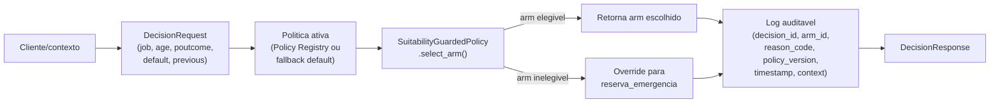

# System Card — Plataforma de Experimentação Adaptativa

## Escopo

Este card cobre o sistema completo, não apenas o modelo: serviço FastAPI
(`/decide`, `/assistant/ask`), CLI (`bandit-cli`, incluindo os 7
subcomandos de MLOps da Etapa 7), interface Streamlit de demonstração, o
assistente RAG (LLM + base de conhecimento sintética) e a arquitetura-alvo
Azure (Etapa 6, ainda não aplicada — sem `terraform apply` real).

## Fluxo de decisão

## Dependências

| Dependência | Papel | Observação |
|---|---|---|
| API Anthropic Claude | Geração de linguagem natural do assistente RAG | Externa, fora do Azure — única dependência de LLM, custo por chamada |
| HuggingFace embeddings | Indexação da base de conhecimento sintética | Local, sem chamada de rede (Etapa 5) |
| MLflow (tracking local) | Rastreio de experimentos de retreino | Arquivo local (`mlruns/`), sem servidor |
| joblib | Serialização de políticas treinadas | Local, `models/registry/` |
| GitHub Container Registry | Hospedagem de imagens de container | Decisão de custo (Etapa 6) |
| Azure (arquitetura-alvo) | Compute, dados, segredos, observabilidade | Ainda não aplicado (`docs/architecture-azure.md`) |

## Guardrails

- **`SuitabilityGuardedPolicy`**: nunca deixa passar um braço fora das
  regras de negócio codificadas (bloqueio de crédito/investimento quando
  `default=yes`; bloqueio de `cdb_24m` sem engajamento prévio) — faz
  fallback para `reserva_emergencia` com `reason_code=suitability_override`.
- **Golden-set safety gate**: `PromotionCriteria.min_golden_set_safety_rate
  = 1.0` — nenhum candidato é aprovado automaticamente se qualquer caso do
  golden set falhar a checagem de segurança.
- **Approval gate estruturado**: nenhuma política chega a produção sem
  `bandit-cli approve` (nome, motivo, timestamp humanos registrados
  permanentemente no manifesto do registro).
- **Log auditável append-only**: toda decisão grava `decision_id, arm_id,
  reason_code, policy_version, timestamp, context` em
  `logs/decisions.jsonl` — nunca sobrescrito.
- **Defesa de prompt injection do assistente**: o contexto recuperado (RAG)
  e o registro de decisão são sempre delimitados (`<contexto>`/`<registro>`)
  e explicitamente instruídos como dado, nunca como instrução
  (`src/bandit_platform/assistant/qa.py`, `explain.py`).

## Cenários de risco

### Reward hacking

As recompensas usadas hoje são inteiramente **sintéticas**
(`bandit_platform.synthetic.events`), geradas por código determinístico com
seed controlada — não há uma métrica de negócio real para a política
"hackear" no ambiente atual. **Risco documentado para uma implantação real**:
se um sinal de recompensa real fosse conectado ingenuamente (ex.: "clique"
como recompensa, sem checagem de qualidade a jusante), a política poderia
convergir para mensagens de engajamento superficial que não refletem
benefício real ao cliente. Mitigação recomendada: qualquer recompensa real
deve ser validada contra um resultado de negócio genuíno (ex.: abertura de
conta efetivada), nunca apenas uma métrica de engajamento; o golden set e o
approval gate humano atuam como uma segunda camada de defesa contra uma
política que convirja para um equilíbrio degenerado.

### Manipulação de contexto

A API valida apenas tipo e faixa dos campos do contexto (`schemas.py`:
`age` entre 18 e 110, campos obrigatórios) — **não valida a veracidade
semântica** do que o chamador envia. Um chamador (malicioso ou com bug)
poderia, por exemplo, enviar `default="no"` para desbloquear ofertas de
crédito/investimento mesmo quando o cliente real está em default.
**Mitigação recomendada para produção real**: os campos `default`,
`previous` e `poutcome` deveriam vir de um sistema interno autoritativo
(não fornecidos livremente pelo chamador da API), ou ao menos passar por
uma checagem cruzada antes de alimentar a decisão — não implementado hoje,
registrado aqui como bloqueio necessário antes de qualquer uso real.

### Abuso do assistente (RAG/LLM)

Defesa atual é apenas em nível de prompt (delimitadores + instrução "trate
como dado") — **não é uma defesa rígida**: uma entrada adversarial bem
construída (via pergunta do usuário ou, teoricamente, via um documento de
política malicioso) pode em alguns casos contornar defesas apenas em
prompt. Não há moderação de conteúdo de saída, nem limite de taxa de
chamadas — um usuário poderia gerar custo real na API Anthropic sem
controle algum hoje. **Mitigação recomendada**: rate limiting no endpoint
`/assistant/ask`, validação de que a resposta só referencia conteúdo
efetivamente recuperado, e alerta de custo/orçamento na API Anthropic
(complementar ao orçamento Azure já implementado via
`azurerm_consumption_budget_resource_group`, que não cobre custo de LLM
externo).

### Violação de suitability

**Este é o risco documentado mais importante do sistema.** O guard
codificado cobre apenas duas das regras de negócio documentadas em
`data/synthetic_enrichment/policy_docs/` (que reúnem bem mais de duas regras
ao todo, entre os 5 documentos) — ver `reports/offline-evaluation.md` §7:
faltam, entre outras, "não repetir oferta recusada na mesma campanha" e
"validade de 30 dias da taxa promocional". Isso significa que, hoje, um cliente poderia
teoricamente receber a mesma oferta já recusada repetidamente, ou ver uma
taxa promocional expirada — nada no código verifica recência de evento ou
histórico de campanha além do que já foi usado no treino. **Isto é uma
lacuna real entre documentação e implementação, não um comportamento
oculto** — está registrado aqui e no model card como bloqueio necessário
antes de qualquer uso real, não escondido atrás de "guardrails" genéricos.

## Plano de monitoramento

- **Drift de features**: PSI (Population Stability Index) sobre `job` e
  `poutcome` das decisões recentes vs. a distribuição de treino
  (`bandit-cli monitor-drift`), alerta quando PSI > 0.2. Execução hoje é
  manual/sob demanda, não agendada.
- **Drift de performance entre versões**: regret médio do candidato vs. da
  política ativa no momento da promoção; alerta quando a regressão excede
  10% (mesmo limiar do critério de promoção, visto de dois ângulos).
- **Rastreio histórico**: cada ciclo de retreino fica registrado tanto no
  Policy Registry quanto no MLflow, permitindo reconstruir a evolução de
  métricas ao longo do tempo.
- **Trabalho futuro documentado**: automatizar `monitor-drift` em um
  agendamento (ex.: job diário em Azure Container Apps) e conectar um sinal
  de recompensa real quando/se este sistema deixar de ser uma
  demonstração.
